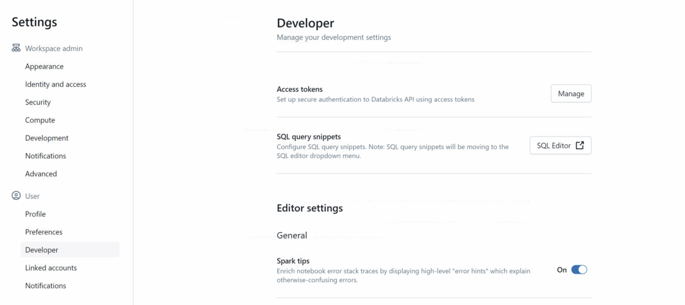
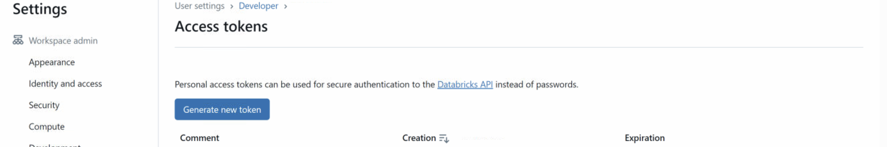

We can use MLFlow import export library to import export the databricks models.

# _Create Databricks Personal Access Token_
  User -> Developer -> Access Token -> Manage -> Generate New token    
  Once the token is generated, copy and save it somewhere as we won't be able to see this later.

  

  

# _Export Model From Source Databricks Workspace_

%pip install git+https://github.com/mlflow/mlflow-export-import
## 1. Configure Databricks CLI
  Once the token is generated, we need to configure teh Databricks CLI.
  1. Start a cluster in Databricks
  2. Go to Web Terminal 
  3. Type `databricks configure` and hit enter
  4. Enter the host Name : https://XXXX.azuredatabricks.net
  5. Enter the databricks user name : XXXX
  6. Enter the password : paste the token generated from above steps

## 2. Export the model
  %sh    
  MLFLOW_TRACKING_URI='databricks://default'        
  DATABRICKS_HOST=https://XXXX.azuredatabricks.net        
  DATABRICKS_TOKEN=paste the token generated from above steps        
  
  export-experiment \         
  -- experiment experiment_id         
  -- output-dir /dbfs/FileStore/models/filename

## Download the created tar experiments using below url
  https://XXXX.azuredatabricks.net/files/models/filename.tar

# _Import Model Into Target Databricks Workspace_
## 1. Upload the downloaded tar file into the workspace and untar the same
    tar : tar cvf filename.tar filename
    untar : tar -xvf filename.tar
## 2. Create databricks Personal Access Token
  Create the token as stated above
## 3. Configure databricks CLI
  1. Start a cluster in Databricks
  2. Go to Web Terminal 
  3. Type `databricks configure` and hit enter
  4. Enter the host Name : https://XXXX.azuredatabricks.net
  5. Enter the databricks user name : XXXX
  6. Enter the password : paste the token generated from above steps
## 4. Import the model
   %sh    
    MLFLOW_TRACKING_URI=databricks    
    DATABRICKS_HOST=https://XXXX.azuredatabricks.net    
    DATABRICKS_TOKEN=paste the token generated from above steps    
    import-experiment \    
    -- experiment-name experiment_id    
    -- input-dir /dbfs/FileStore/models/filename    

# _Register Model to Unity Catalog_

%pip install "mlflow-skinny[databricks]>=2.4.1"
dbutils.library.restartPython()

import mlflow    
catalog="XX"    
schema="XXXX"    
model_name="XXXX"    
mlflow.set_registry_uri("databricks-uc")    
mlflow.register.model("runs:/XXXXX/model",f"{catalog}.{schema}.{model_name}")     

